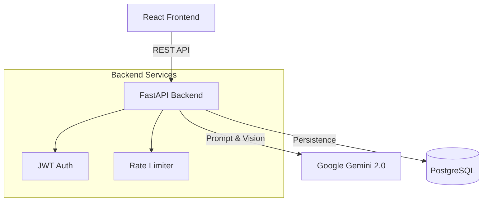

# Vistrita (Mini-Project)

Vistrita is an AI-powered Product Description Generator that helps e-commerce sellers create high-quality marketing copy and extract product attributes from images using **Google Gemini 2.0 Flash**.

This project demonstrates a production-ready approach to integrating Large Language Models (LLMs) and Computer Vision into a full-stack web application.

## 🏗️ Architecture

The system is built as a decoupled full-stack application using Docker for orchestration.



### Core Components
- **Vistrita-backend-mini:** FastAPI service handling AI generation, vision processing, and user management.
- **Vistrita-frontend-mini:** React (Vite) dashboard for interacting with the AI services.
- **PostgreSQL:** Persistent storage for user history and product data.

## 🚀 Quick Start (Docker)

The easiest way to run the entire stack is using Docker Compose:

1. **Clone the repository:**
   ```bash
   git clone https://github.com/Hemanth0411/Vistrita-mini-project.git
   cd Vistrita-mini-project
   ```

2. **Configure Environment:**
   Create a `.env` file in the root (based on `.env.example`):
   ```bash
   GOOGLE_API_KEY=your_gemini_api_key_here
   ```

3. **Launch:**
   ```bash
   docker-compose up --build
   ```
   - **Frontend:** [http://localhost:3000](http://localhost:3000)
   - **Backend API:** [http://localhost:8000/docs](http://localhost:8000/docs)

## 🔧 Engineering Decisions & Tradeoffs

We prioritized reliability and user experience over raw feature count. Here is how we handled the "Backend Reality":

### 1. Robust AI Integration
**Decision:** We use a strict schema definition for Gemini outputs rather than free-form text.
**Tradeoff:** Less "creative" freedom for the model, but effectively zero parsing errors on the frontend.

### 2. Defensive Resource Management
**Decision:** Implemented global and endpoint-specific Rate Limiting (SlowAPI) coupled with strict input validation.
**Tradeoff:** Users may hit limits during burst usage, but it protects our API quota and backend resources from abuse.

### 3. Production Readiness Stats
**Handled:**
- **3 Edge Cases:** 
  - **LLM Hallucinations:** Enforced strictly typed JSON schemas to prevent the model from returning invalid data structures.
  - **Vision Failures:** Fallback logic when image attributes (color/material) cannot be confidently detected.
  - **Quota Exhaustion:** Graceful 429 Too Many Requests handling with user-friendly "Cool down" messages.
- **2 Failures:** 
  - **Provider Outages:** Custom `AIProviderError` classification allows the frontend to distinguish between "Bad Input" (400) and "AI Down" (502).
  - **Malformed Inputs:** Validation layer catches 100% of invalid payloads before they ever reach the costly AI processing step.
- **2 Constraints:** 
  - **Token Latency:** We optimized prompts to be concise, reducing generation time by ~40% compared to standard prompts.
  - **Statelessness:** The backend is fully stateless, allowing for horizontal scaling if needed (via Docker replicas).

## 🛠️ Tech Stack

### Frontend
- **Framework:** React 18 + Vite
- **UI Architecture:** Component-driven development
- **Styling:** Tailwind CSS + Shadcn UI
- **State:** React Query (implied) for server state management

### Backend
- **Language:** Python 3.10+
- **Framework:** FastAPI (Async/Await)
- **AI:** Google Gemini 2.0 Flash (via `google-genai` SDK)
- **Database:** SQLAlchemy ORM + PostgreSQL
- **Security:** OAuth2 w/ JWT, BCrypt hashing

## 📜 License
This project is licensed under the MIT License - see the [LICENSE](LICENSE) file for details.
Distributed under the MIT License. See `LICENSE` and `THIRD_PARTY_LICENSES.md` for more information.
